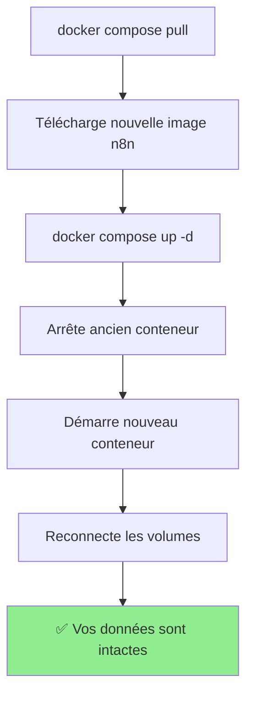

# Guide de Mise à Jour n8n

## 🎯 Réponse Rapide

**Question** : Mes données seront-elles perdues lors d'une mise à jour ?

**Réponse** : **NON !** ✅ Vos données sont **automatiquement préservées** lors d'une mise à jour Docker.

---

## 🔒 Pourquoi vos données sont sécurisées

### Architecture de stockage

```
┌─────────────────────────────────────────┐
│         Conteneur n8n (mis à jour)      │
│  ┌────────────────────────────────┐     │
│  │   Application n8n              │     │
│  │   (version X.Y.Z)              │     │
│  └────────────────────────────────┘     │
│              ↓                          │
│         Monte les volumes               │
└─────────────────────────────────────────┘
              ↓
┌─────────────────────────────────────────┐
│      Volumes Docker (PERSISTANTS)       │
│  ┌────────────────┐  ┌───────────────┐  │
│  │  n8n_data      │  │ postgres_data │  │
│  │  - Config      │  │ - Workflows   │  │
│  │  - Files       │  │ - Credentials │  │
│  │  - Cache       │  │ - Executions  │  │
│  └────────────────┘  └───────────────┘  │
│                                         │
│  ⚠️ INDÉPENDANTS DES CONTENEURS         │
└─────────────────────────────────────────┘
```

### Ce qui se passe lors d'une mise à jour



---

## 🚀 Méthodes de Mise à Jour

### Méthode 1 : Script Automatisé (Recommandé)

Le script `update-n8n.ps1` fait tout pour vous :

```powershell
# Mise à jour complète avec backup
.\scripts\update-n8n.ps1
```

**Ce que fait le script :**

1. ✅ Exporte tous vos workflows vers `workflows/production/`
2. ✅ Crée un backup des volumes Docker dans `backup_YYYY-MM-DD_HH-mm/`
3. ✅ Télécharge la nouvelle version de n8n
4. ✅ Redémarre les conteneurs
5. ✅ Vérifie que tout fonctionne

**Options disponibles :**

```powershell
# Mise à jour rapide sans backup (données toujours préservées)
.\scripts\update-n8n.ps1 -SkipBackup

# Mise à jour sans export de workflows
.\scripts\update-n8n.ps1 -SkipWorkflowExport

# Mise à jour ultra-rapide
.\scripts\update-n8n.ps1 -SkipBackup -SkipWorkflowExport
```

### Méthode 2 : Manuelle

```powershell
# 1. Exporter les workflows (optionnel mais recommandé)
.\scripts\export-workflows.ps1

# 2. Télécharger la nouvelle version
docker compose pull

# 3. Redémarrer avec la nouvelle version
docker compose up -d

# 4. Vérifier que tout fonctionne
docker compose ps
docker compose logs -f n8n
```

### Méthode 3 : Avec backup manuel complet

```powershell
# 1. Créer un dossier de backup
$backupDir = "backup_$(Get-Date -Format 'yyyy-MM-dd_HH-mm')"
New-Item -ItemType Directory -Path $backupDir

# 2. Exporter les workflows
.\scripts\export-workflows.ps1
Copy-Item -Path "workflows/production/*" -Destination "$backupDir/workflows/" -Recurse

# 3. Sauvegarder les volumes Docker
docker run --rm -v upsylon-n8n-secured_n8n_data:/data -v ${PWD}/${backupDir}:/backup alpine tar czf /backup/n8n_data.tar.gz -C /data .
docker run --rm -v upsylon-n8n-secured_postgres_data:/data -v ${PWD}/${backupDir}:/backup alpine tar czf /backup/postgres_data.tar.gz -C /data .

# 4. Mettre à jour
docker compose pull
docker compose up -d

# 5. Vérifier
docker compose ps
```

---

## ⚠️ Commandes DANGEREUSES à éviter

### ❌ NE JAMAIS FAIRE

```powershell
# ❌ SUPPRIME VOS VOLUMES ET DONC VOS DONNÉES !
docker compose down -v

# ❌ SUPPRIME LE VOLUME n8n_data !
docker volume rm upsylon-n8n-secured_n8n_data

# ❌ SUPPRIME TOUS LES VOLUMES NON UTILISÉS !
docker volume prune
```

### ✅ Commandes SÛRES

```powershell
# ✅ Arrête les conteneurs, PRÉSERVE les volumes
docker compose down

# ✅ Redémarre les conteneurs
docker compose restart

# ✅ Voir les logs
docker compose logs -f

# ✅ Mettre à jour
docker compose pull && docker compose up -d
```

---

## 📊 Tableau de Comparaison

| Action                   | Données préservées ? | Workflows préservés ? | Backup recommandé ? |
| ------------------------ | -------------------- | --------------------- | ------------------- |
| `docker compose up -d`   | ✅ Oui               | ✅ Oui                | ❌ Non              |
| `docker compose restart` | ✅ Oui               | ✅ Oui                | ❌ Non              |
| `docker compose down`    | ✅ Oui               | ✅ Oui                | ❌ Non              |
| `docker compose pull`    | ✅ Oui               | ✅ Oui                | ✅ Oui (workflows)  |
| `docker compose down -v` | ❌ **NON**           | ❌ **NON**            | ⚠️ Trop tard !      |
| `docker volume rm`       | ❌ **NON**           | ❌ **NON**            | ⚠️ Trop tard !      |

---

## 🛡️ Stratégie de Sauvegarde Recommandée

### Sauvegarde Quotidienne (Automatisée)

Créez une tâche planifiée Windows pour exporter les workflows chaque jour :

```powershell
# Créer le script de backup quotidien
$scriptPath = "C:\dev\UPSYLON-TEMPLATES\N8N-AUTOMAT\upsylon-n8n-secured\scripts\export-workflows.ps1"

# Créer une tâche planifiée (à exécuter manuellement une fois)
$action = New-ScheduledTaskAction -Execute "PowerShell.exe" -Argument "-File `"$scriptPath`""
$trigger = New-ScheduledTaskTrigger -Daily -At 2am
$principal = New-ScheduledTaskPrincipal -UserId "$env:USERNAME" -LogonType Interactive
$settings = New-ScheduledTaskSettingsSet -AllowStartIfOnBatteries -DontStopIfGoingOnBatteries

Register-ScheduledTask -TaskName "n8n Workflow Backup" -Action $action -Trigger $trigger -Principal $principal -Settings $settings
```

### Sauvegarde Avant Mise à Jour Majeure

Avant une mise à jour majeure (ex: v1.x.x → v2.x.x) :

```powershell
# Utiliser le script avec backup complet
.\scripts\update-n8n.ps1
```

### Sauvegarde Hebdomadaire des Volumes

```powershell
# Créer un backup complet hebdomadaire
$backupDir = "backup_weekly_$(Get-Date -Format 'yyyy-MM-dd')"
New-Item -ItemType Directory -Path $backupDir

docker run --rm -v upsylon-n8n-secured_n8n_data:/data -v ${PWD}/${backupDir}:/backup alpine tar czf /backup/n8n_data.tar.gz -C /data .
docker run --rm -v upsylon-n8n-secured_postgres_data:/data -v ${PWD}/${backupDir}:/backup alpine tar czf /backup/postgres_data.tar.gz -C /data .
```

---

## 🔄 Restauration en cas de Problème

### Restaurer les workflows

```powershell
# Importer les workflows depuis Git
.\scripts\import-workflows.ps1 -Force
```

### Restaurer les volumes Docker

```powershell
# Arrêter les conteneurs
docker compose down

# Restaurer n8n_data
docker run --rm -v upsylon-n8n-secured_n8n_data:/data -v ${PWD}/backup_YYYY-MM-DD:/backup alpine sh -c "cd /data && tar xzf /backup/n8n_data.tar.gz"

# Restaurer postgres_data
docker run --rm -v upsylon-n8n-secured_postgres_data:/data -v ${PWD}/backup_YYYY-MM-DD:/backup alpine sh -c "cd /data && tar xzf /backup/postgres_data.tar.gz"

# Redémarrer
docker compose up -d
```

---

## 📋 Checklist de Mise à Jour

### Avant la mise à jour

- [ ] Vérifier la version actuelle : `docker compose exec n8n n8n --version`
- [ ] Lire les notes de version : https://github.com/n8n-io/n8n/releases
- [ ] Exporter les workflows : `.\scripts\export-workflows.ps1`
- [ ] Commiter les workflows : `git add workflows/ && git commit -m "chore: Backup workflows"`

### Pendant la mise à jour

- [ ] Exécuter : `.\scripts\update-n8n.ps1`
- [ ] Attendre la fin du script
- [ ] Vérifier les logs : `docker compose logs -f n8n`

### Après la mise à jour

- [ ] Vérifier l'interface web
- [ ] Tester un workflow simple
- [ ] Vérifier que les credentials sont présents
- [ ] Vérifier l'historique des exécutions
- [ ] Tester les webhooks si utilisés

---

## 🆘 Dépannage

### La mise à jour échoue

```powershell
# Voir les logs détaillés
docker compose logs -f

# Revenir à l'ancienne version
docker compose down
docker pull docker.n8n.io/n8nio/n8n:previous-version
docker compose up -d
```

### Les workflows ne s'affichent plus

```powershell
# Vérifier que PostgreSQL fonctionne
docker compose ps postgres

# Vérifier les logs PostgreSQL
docker compose logs postgres

# Redémarrer PostgreSQL
docker compose restart postgres
```

### Erreur de migration de base de données

```powershell
# Voir les logs de migration
docker compose logs n8n | Select-String "migration"

# Si nécessaire, restaurer depuis un backup
# (voir section Restauration)
```

---

## 📚 Ressources

- [Notes de version n8n](https://github.com/n8n-io/n8n/releases)
- [Guide de migration](https://docs.n8n.io/hosting/installation/updating/)
- [Documentation Docker](https://docs.docker.com/storage/volumes/)
- [TROUBLESHOOTING.md](TROUBLESHOOTING.md) - Guide de dépannage
- [WORKFLOWS_VERSIONING.md](WORKFLOWS_VERSIONING.md) - Versionnement des workflows

---

## 💡 Résumé

✅ **Vos données sont TOUJOURS préservées** lors d'une mise à jour normale

✅ **Les volumes Docker sont indépendants** des conteneurs

✅ **Utilisez le script `update-n8n.ps1`** pour une mise à jour sécurisée

❌ **N'utilisez JAMAIS `docker compose down -v`** sauf si vous voulez tout supprimer

🛡️ **Exportez vos workflows régulièrement** avec `export-workflows.ps1`
